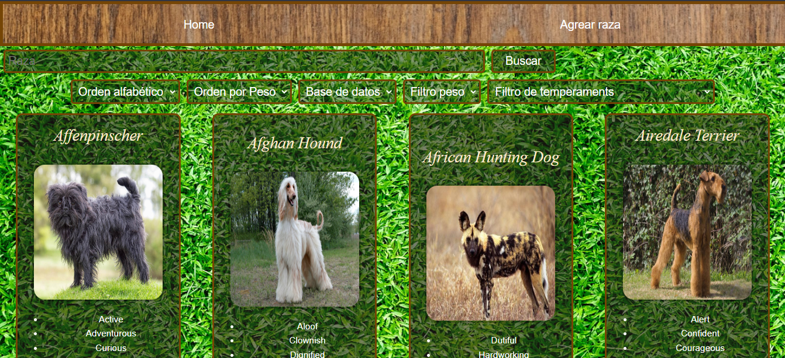
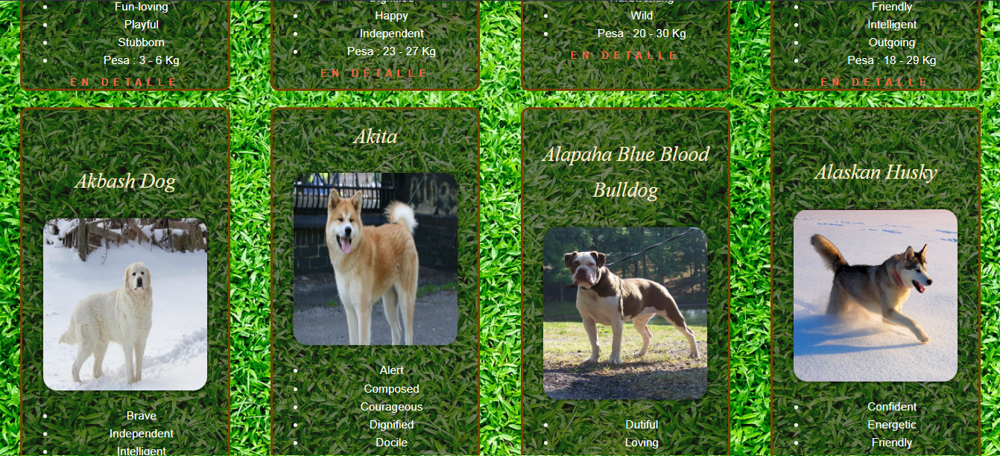
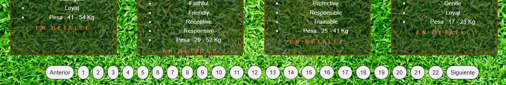
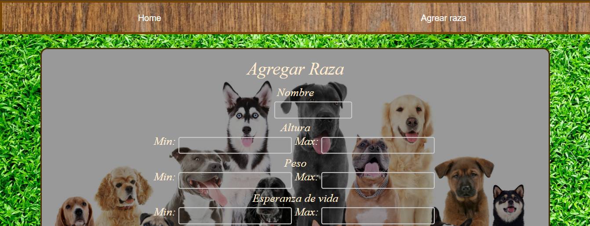
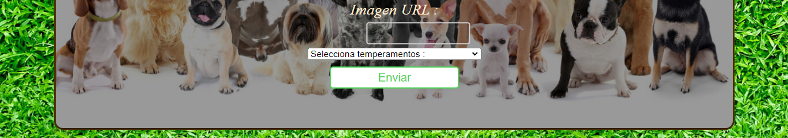
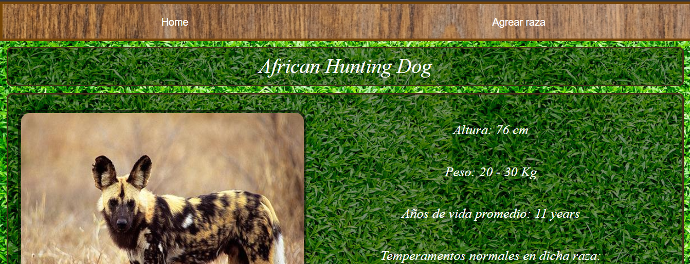
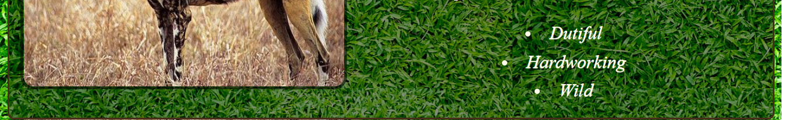
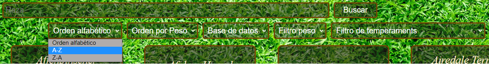

<h3 align="left">Solo project:</h3>
<h4 align="left">This project was made with "SQL, REACT, REDUX, SEQUELIZE, EXPRESS and AXIOS":</h4>
<h4 align="left">Deploy: https://dogs25.vercel.app/</h4>

<h4 align="left">More dogs can be added:</h4>

<h4 align="left">see in detail:</h4>

<h4 align="left">can be filtered, sorted and searched:</h4>

